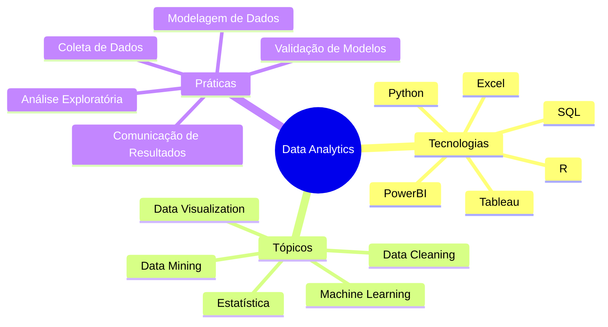
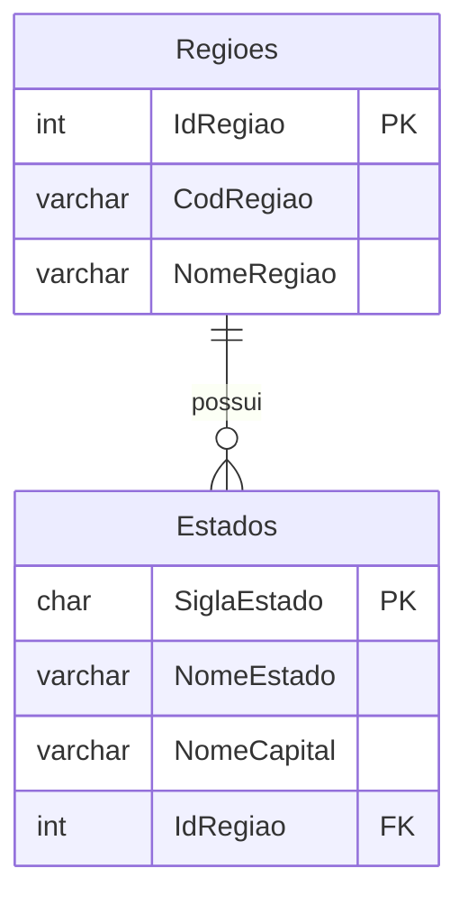

# Mermaid-Copilot_DataSaturday-2024-10
Materiais da apresentação "IA + Documentação em Bancos de Dados: utilizando GitHub Copilot + Mermaid para gerar diagramas". Palestra realizada durante o Data Saturday em Vitória-ES no dia 26/10/2024.

---

## Mindmap

Pergunta ao Copilot:

```
Gostaria de um mapa mental em Mermaid que traga tecnologias, tópicos e práticas que preciso estudar para conhecer mais sobre Data Analytics
```

Resposta:



---

## Entidade-Relacionamento

Gere um diagrama de entidade-relacionamento em Mermaid para o script:

```sql
CREATE DATABASE BaseDadosGeograficos
GO

USE BaseDadosGeograficos
GO

CREATE TABLE dbo.Regioes(
	IdRegiao int NOT NULL,
	CodRegiao varchar(2) NOT NULL,
	NomeRegiao varchar(20) NOT NULL,
	CONSTRAINT PK_Regioes PRIMARY KEY (IdRegiao)
)
GO

CREATE TABLE dbo.Estados(
	SiglaEstado char(2) NOT NULL,
	NomeEstado varchar(20) NOT NULL,
	NomeCapital varchar(20) NOT NULL,
	IdRegiao int NOT NULL,
	CONSTRAINT PK_Estados PRIMARY KEY (SiglaEstado),
	CONSTRAINT FK_Estado_Regiao FOREIGN KEY (IdRegiao) REFERENCES dbo.Regioes(IdRegiao)
)
GO
```

Resultado:

