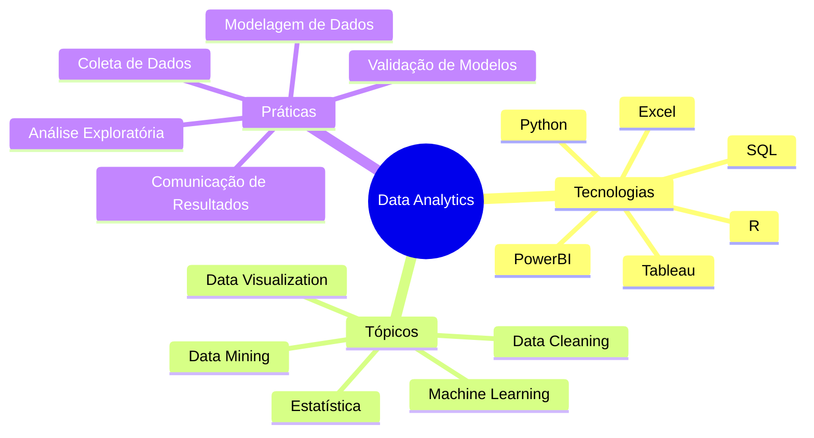

# Mermaid-Copilot_DataSaturday-2024-10
Materiais da apresentação "IA + Documentação em Bancos de Dados: utilizando GitHub Copilot + Mermaid para gerar diagramas". Palestra realizada durante o Data Saturday em Vitória-ES no dia 26/10/2024.

---

## Mindmap

Pergunta ao Copilot:

```
Gostaria de um mapa mental em Mermaid que traga tecnologias, tópicos e práticas que preciso estudar para conhecer mais sobre Data Analytics
```

Resposta:


