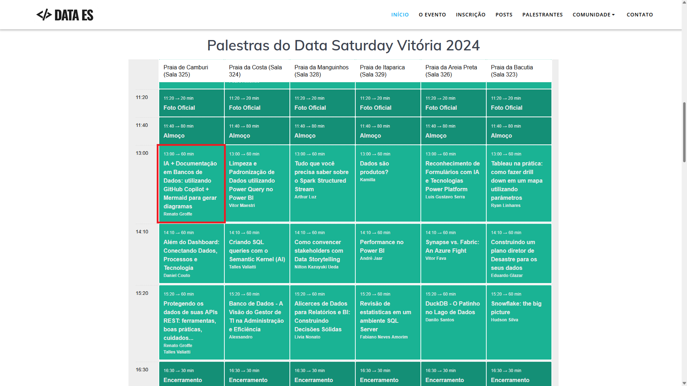
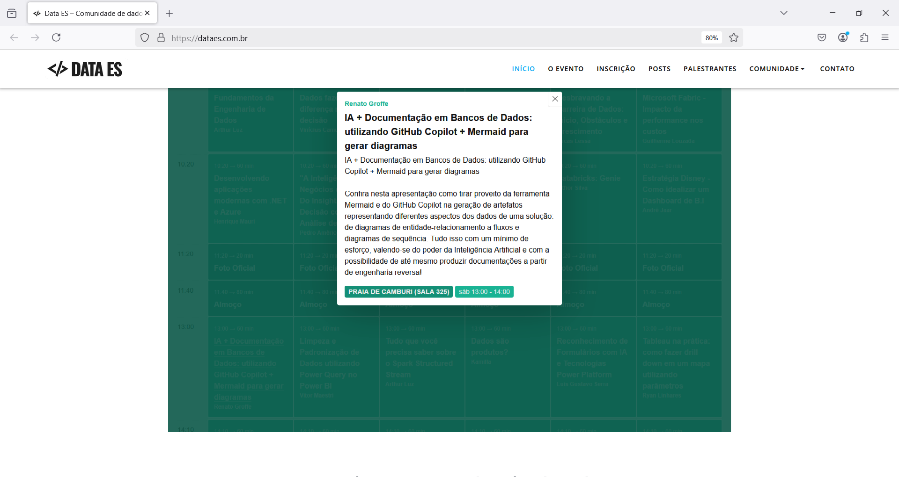
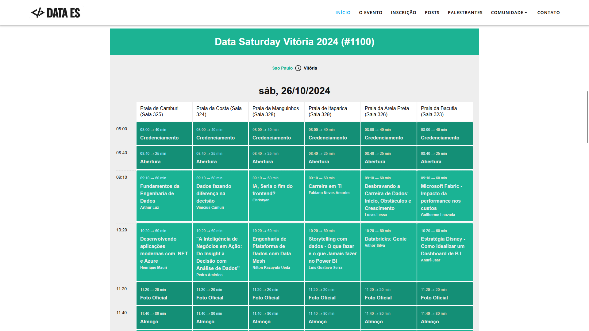
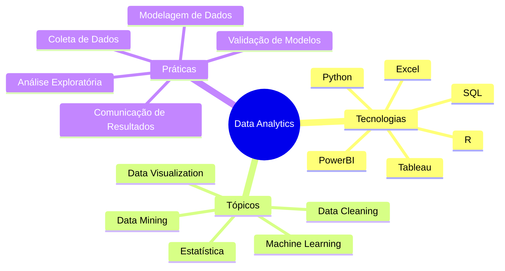
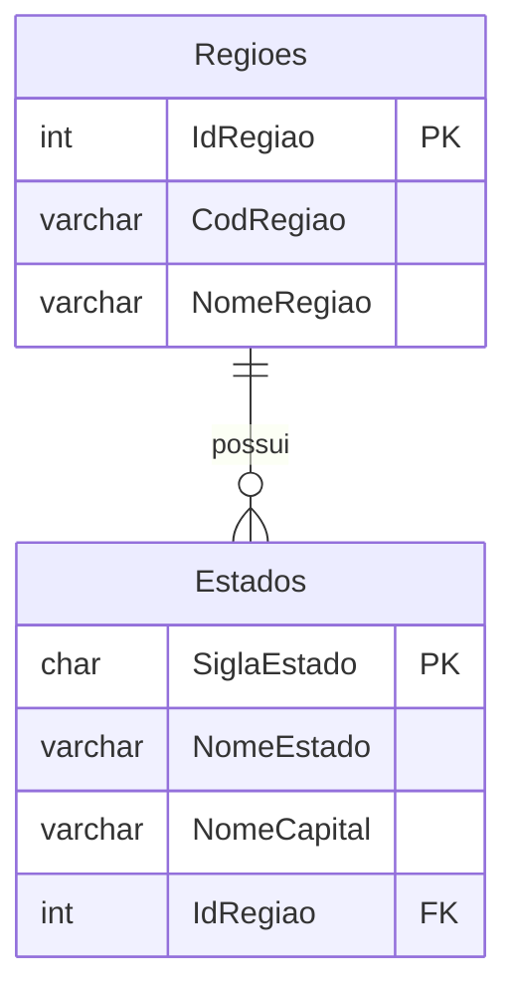
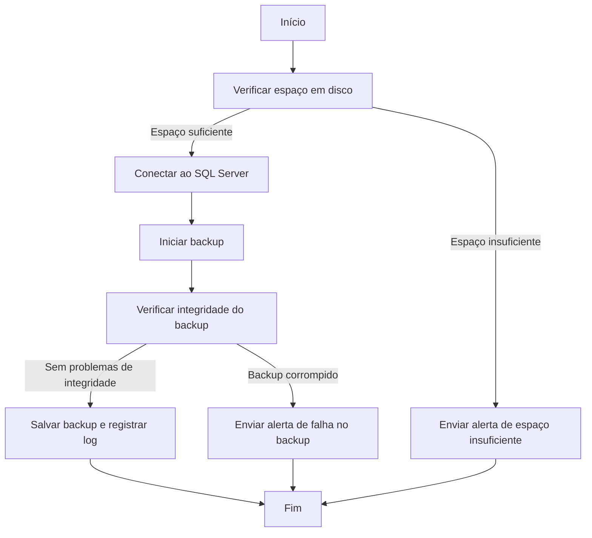
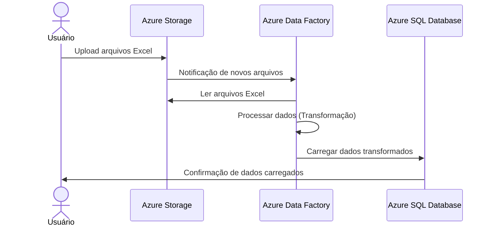
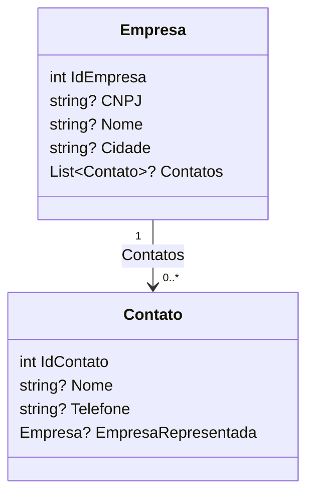

# Mermaid-Copilot_DataSaturday-2024-10
Materiais da apresentação "IA + Documentação em Bancos de Dados: utilizando GitHub Copilot + Mermaid para gerar diagramas". Palestra realizada durante o Data Saturday em Vitória-ES no dia 26/10/2024.

---

Título da apresentação: **IA + Documentação em Bancos de Dados: utilizando GitHub Copilot + Mermaid para gerar diagramas**

Descritivo da apresentação: *Confira nesta apresentação como tirar proveito da ferramenta Mermaid e do GitHub Copilot na geração de artefatos representando diferentes aspectos dos dados de uma solução: de diagramas de entidade-relacionamento a fluxos e diagramas de sequência. Tudo isso com um mínimo de esforço, valendo-se do poder da Inteligência Artificial e com a possibilidade de até mesmo produzir documentações a partir de engenharia reversa!*

Data: **26/10/2024 (sábado)**

Tecnologias e tópicos abordados: **GitHub Copilot, Mermaid, Visual Studio Code, GitHub, Documentação de Projetos, SQL Server, UML, .NET, Entity Framework, Azure Data Factory...**

Número de participantes: **100 pessoas (estimativa)**

Evento: **Data Saturday Vitória 2024**

Links do evento: **[SQLSaturday](https://sqlsaturday.com/2024-10-26-sqlsaturday1100/)** | **[Data ES - Site](https://dataes.com.br/)** | **[Sessionize](https://sessionize.com/sql-saturday-vitoria-2024/)**

Local: **PECEGE - Rua Cezira Giovanoni Moretti, 580 - Santa Rosa - Vitória-ES - CEP: 13414-157**

Deixo aqui meus agradecimentos ao **Dirceu Resende**, ao **Talles Valiatti** e demais organizadores por todo o apoio para que eu partipasse como palestrante de mais uma edição do **Data Saturday** em **Vitória**.

---









---

## Mindmap

Pergunta ao Copilot:

```
Gostaria de um mapa mental em Mermaid que traga tecnologias, tópicos e práticas que preciso estudar para conhecer mais sobre Data Analytics
```

Resposta:



---

## Entidade-Relacionamento

Gere um diagrama de entidade-relacionamento em Mermaid para o script:

```sql
CREATE DATABASE BaseDadosGeograficos
GO

USE BaseDadosGeograficos
GO

CREATE TABLE dbo.Regioes(
	IdRegiao int NOT NULL,
	CodRegiao varchar(2) NOT NULL,
	NomeRegiao varchar(20) NOT NULL,
	CONSTRAINT PK_Regioes PRIMARY KEY (IdRegiao)
)
GO

CREATE TABLE dbo.Estados(
	SiglaEstado char(2) NOT NULL,
	NomeEstado varchar(20) NOT NULL,
	NomeCapital varchar(20) NOT NULL,
	IdRegiao int NOT NULL,
	CONSTRAINT PK_Estados PRIMARY KEY (SiglaEstado),
	CONSTRAINT FK_Estado_Regiao FOREIGN KEY (IdRegiao) REFERENCES dbo.Regioes(IdRegiao)
)
GO
```

Resultado:



---

## Flowchart

Pergunta ao Copilot:

```
Como seria em um fluxograma do Mermaid uma rotina automatizada de backup do SQL Server?
```

Resultado:



---

## Diagrama de sequência

Pergunta ao Copilot:

```
Como seria um diagrama de sequência em Mermaid de um processo de ETL que usa arquivos do Excel como origem e que estão no Azure Storage, processando os dados via Azure Data Factory e consolidando isso numa base do Azure SQL?
```

Resposta:



## Diagrama de classes

Estrutura:

```csharp
using System.ComponentModel.DataAnnotations;
using System.ComponentModel.DataAnnotations.Schema;
using System.Text.Json.Serialization;

namespace BenchmarkingDapperEFCoreCRMMySql.EFCore;

public class Empresa
{
    [Key]
    public int IdEmpresa { get; set; }
    public string? CNPJ { get; set; }
    public string? Nome { get; set; }
    public string? Cidade { get; set; }
    public List<Contato>? Contatos { get; set; }
}

public class Contato
{
    [Key]
    public int IdContato { get; set; }
    public string? Nome { get; set; }
    public string? Telefone { get; set; }

    [ForeignKey("IdEmpresa")]
    [JsonIgnore]
    public Empresa? EmpresaRepresentada { get; set; }
}
```

Resultado:

